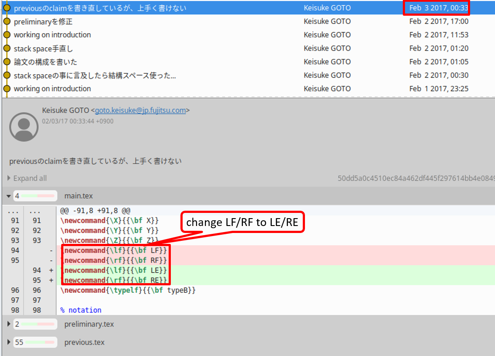

The purpose of this document is to clarify some facts about a [document](https://suffixsorting.github.io/) which is about my paper [arxiv.1703.01009](https://arxiv.org/abs/1703.01009) and a paper [arxiv.1610.08305](https://arxiv.org/abs/1610.08305) written by the authors of the document. Some points of their claims are incorrect, and I hope that this document solves their misunderstandings.

## Backgrounds

They proposed a first optimal in-place suffix array construction algorithm and uploaded their paper to arXiv in October 2016. I also proposed an optimal in-place algorithm and submitted my paper to ICALP 2017 in February 2017 and uploaded it to arXiv in March 2017. In my paper, I claimed that my work was an independent of theirs. Both algorithms are based on the induced sorting framework. Note that my algorithm assumes stronger assumption than theirs, so my result is weaker than theirs.

## Their Claims

They claimed the following three points about their and my papers.

1. My paper was not independent work of theirs although my paper claimed that.
   1. Reason: My paper was on the public 4 months after theirs were on the public.
2. My paper was written after reading their paper.
   1. Reason: My paper used a notation used in theirs.
3. My paper was made by reconstructing the contents of theirs and tried to cover the fact.
   1. Reason: My paper used a notation used in theirs, and later changed its name.
   2. Reason: The essence of my paper was similar to theirs despite the problem had been the open problem for ten years.

## My Claims

I clarify some facts about their claims and later show supplements supporting these facts.

### About Their Claim 1

> My paper was not independent work of theirs although my paper claimed that.

I had developed my algorithm and had been writing my paper in October 2016 when their paper was on the public. See supplements in the next section that contains several evidence such as git log, slides, and paper at this time. After their paper was on the public, I read their paper and thought the essence of my and their algorithms were different (although they do not think so). So I thought it was no problem to write my paper as independent work of theirs. Although it took 4 months for my paper to be on the public, I claimed that my paper was independent of ours in this perspective.

### About Their Claim 2

> My paper was written after reading their paper.

This is partly yes. I started writing my paper in July 2016, but it took many days for finishing my paper. There are two reasons: (1) I am not good at writing English, and writing speed is very slow compared to other persons. (2) I had to write and submit patents about my paper before my paper was on the public since I worked at a company. I was writing my paper and also working for the patents in parallel, and they took many days. I had not finished writing when their paper was on the public in October 2016, and kept writing after I read their paper.

> Reason: My paper used a notation used in theirs.

Yes, I will comment about this in the next subsection.

### About Their Claim 3

> My paper was made by reconstructing the contents of theirs, and covered the fact.

No, it is not correct.

> Reason: My paper used a notation used in theirs, and later changed its name.

Yes. I used their notation LF/RF used in their paper and later changed the name to LE/RE, where LF/RF and LE/RE are abbreviations of leftmost/rightmost-free and leftmost/rightmost-empty, respectively. However, changing notation did not intend to cover the fact.

When I read their paper, I thought this was a good notation. The definition of LF/RF is the same of bkt which is commonly used in previous works (they extended and used bkt (LF/RF) in their algorithms), but its name is more specific than bkt. So I used the notation and renamed bkt to LF/RF in my paper in November 2016, see also a git log in the next section.

After I used LF/RF, I thought that I preferred using the name leftmost/rightmost empty than leftmost/rightmost free since I had used a notation empty as a special state in my algorithm, it frequently appeared in my paper, and I thought that changing the notation would make my paper be more consistent. So I changed the name LF/RF to LE/RE in February 2017, see also a git log in the next section.

At this time, I did not think that this was a bad behavior for two reasons. (1) I used just their name and the definition is the same as bkt which was commonly used in previous works. (2) I thought that readers could understand this notation came from their paper since the name of LE/RE was very similar to that of LF/RF. Now, I think that this is a bad manner. Since I wrote that my paper is independent work of theirs, some people do not think the notation came from theirs. Making good notations is also a contribution of research, so I had to carefully consider about this. I would like to apologize for this to them.

> Reason: The essence of my paper was similar to theirs despite the problem had been the open problem for ten years.

I don't think so. I quote the reason they claimed.

> Many technical parts of his paper are also very similar to ours (excluding what is known from the literature).
>
> For example, Transition 7 (Sort L-suffixes from the sorted LMS-suffixes) is the main technical "contribution" of his paper (the length is about half of the length of all Transition 1-9). However, his step is sufficiently similar to our Step 1 (Induced sort all L-suffixes from the sorted LMS-suffixes) in Section 3.7. This is where we develop the interior counter trick, which is one of the main new tricks (in this trick we used LF-entry).

I did not think so when I read their paper for the first time in October 2016. Now, I read again after reading their claim, and I agreed that Transition 7 in my paper is partly similar to Section 3.7 in their paper. However, I think that this similarity came from Nong's work [Nong, TOIS 2013] which was the state of the art. Nong used the similar technique to realize in-place suffix array construction in the recursive steps (but this cannot be applied for the initial step, and it does not run in-place in the whole steps). There are two technical issues for realizing in-place suffix array in the whole steps, how to store bkt (LF/RF and LE/RE) and type arrays in the output space (that is suffix array). Nong solved these issues only in recursive steps. My paper and their paper solved these issues in the whole steps (although I used a strong assumption). I think I used a different approach than theirs, and especially how to store the type array.

> In sum, it is hard for us to believe that one can come up with an algorithm so similar to ours independently, with a notation name in the figure same as ours but inconsistent with other parts of the paper, just four months after we made our work available online. Note that the problem we solved was open for ten years.

I apologize to theirs again for using their notation in a bad manner and for making them misunderstanding. I will refer to their work for the notation LE/RE in the next version of my paper.

In my experience, it sometimes occurs that essentially same algorithms are proposed by different authors simultaneously. For example, I heard that the first optimal LCP array construction algorithm [Kasai, CPM 2001] was proposed by two groups, and they were submitted to the same conference and later were merged. I also heard that the first optimal on-line CDAWG construction algorithm [Inenaga, CPM 2001] was the same situation. Note that LCP arrays and CDAWGs are data structures which are very related to suffix arrays. Moreover, developing in-place algorithms, that is, what we can use only really small space is a very strong limitation in general. In-place algorithms cannot do many things, so tend to go to same ideas. Honestly speaking, I had not known Franceschini and Muthukrishnan's work, which proposed the optimal in-place suffix array construction algorithm for the different problem setting with mine, when I had developed my algorithm. However, some technical points in mine were the same as Franceschini and Muthukrishnan's ones. Although this problem had been open for ten years, it had been studied well and many techniques for the solution were proposed by not only me and them but also many researchers.

## Supplements

I describe time series of my research, and put some evidence supporting the facts in the previous section. 

- June 25, 2016: The research started.
  - I talked with a doctoral student (at this time), and he asked me whether a phi array, which is a similar array to a suffix array, can be computed in-place by extending my algorithm I proposed before. I answered it seemed difficult because my algorithm is based on Nong's suffix array construction algorithm, and we can probably compute the suffix array in-place which is considered as a difficult problem if we can compute the phi array in-place.
    At the midnight of the day, I remembered this talk again, and I am interested in this difficult problem and started research.
- July 20, 2016: My algorithm was almost developed, and started writing.
  - I developed an in-place suffix array construction algorithm (although it was not sophisticated at this time). I told that to my supervisors when I was a student by e-mail, and ask them for validating my algorithm. Moreover, I made a repository and started writing on it.
  - Remark: There is an e-mail log. However, I do not put it on the public, since it was written in only Japanese, and other topics are also contained in the e-mail.
  - Remark: There is a git log, see the following capture. According to the git log, I made a repository on July 20, 2016, and added figures on July 28, 2016, which showed plots of my algorithm. Comparing these figures and that in the current version of my paper, many points are matched. This implies that the core idea of my algorithm had been developed in July 2016. Moreover, I had used the notation bkt not LF/RF at this time.
    
  - 
  - Comparison 1
  - Comparison 2

- August 16, 2016: I introduced my algorithm to my former supervisors.
  - They believed that my algorithm was correct.
  - Remark: There is a [slide](file/slide_in_august.pdf).
- October 28, 2016: Their paper [arxiv.1610.08305](https://arxiv.org/abs/1610.08305) was uploaded to arXiv.
  - Remark: There is [my paper](file/main-october.pdf) at this time although which is under construction and which is very messy.
- November 10, 2016: I changed the notation in my paper from bkt to LF/RF which is the notation used in their paper.
  - Remark: There is a git log, see the following capture which is succeeding to the git log which is already shown.
  - 
- February 3, 2017: I changed the notation in my paper from LF/RF to LE/RE.
  - 
- February 14, 2017: I submitted patents about my paper to the Japan patent office.
- February 17, 2017: I submitted my paper to ICALP 2017.
- March 3, 2017: I uploaded my paper [arxiv.1703.01009](https://arxiv.org/abs/1703.01009) to arXiv.

